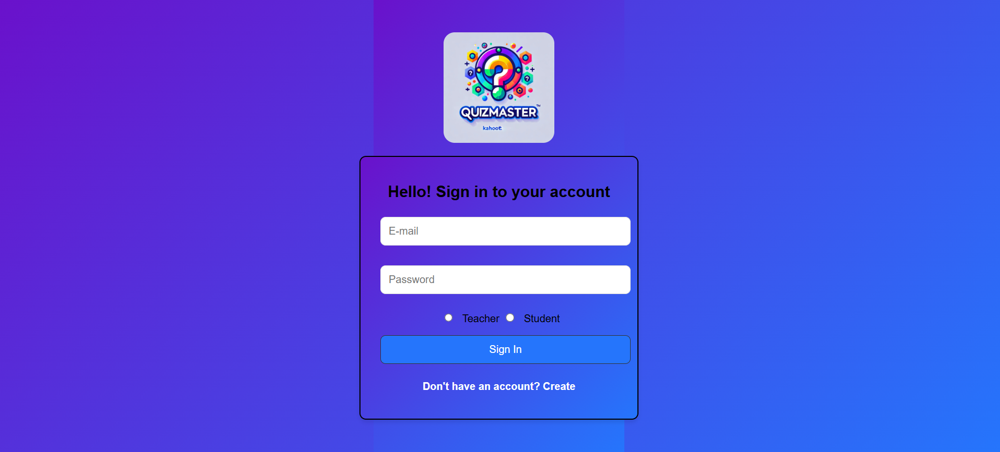
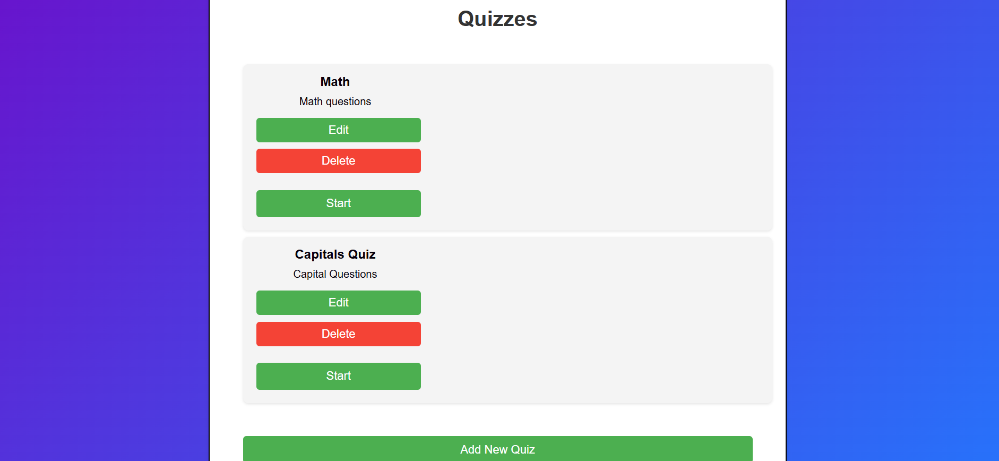
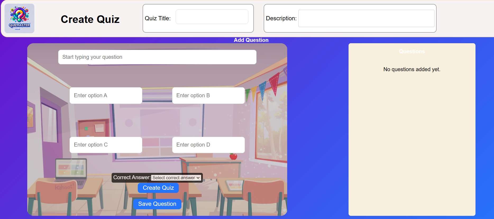
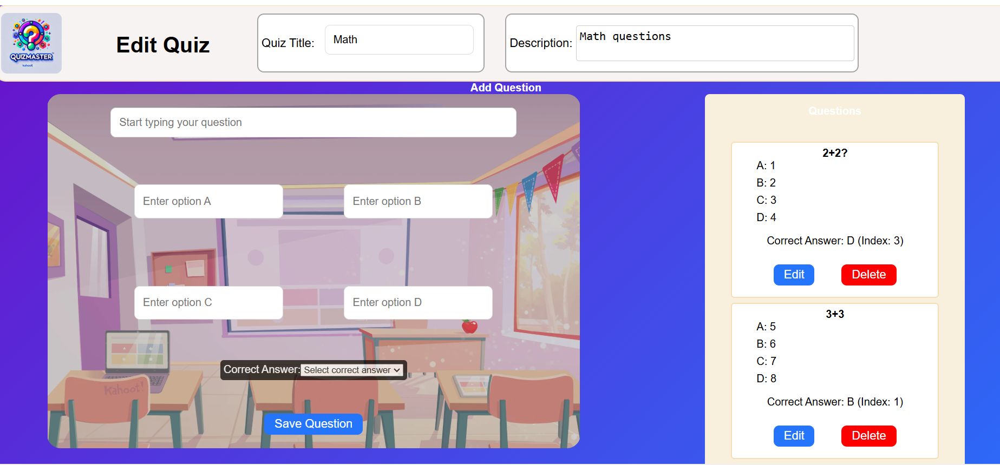
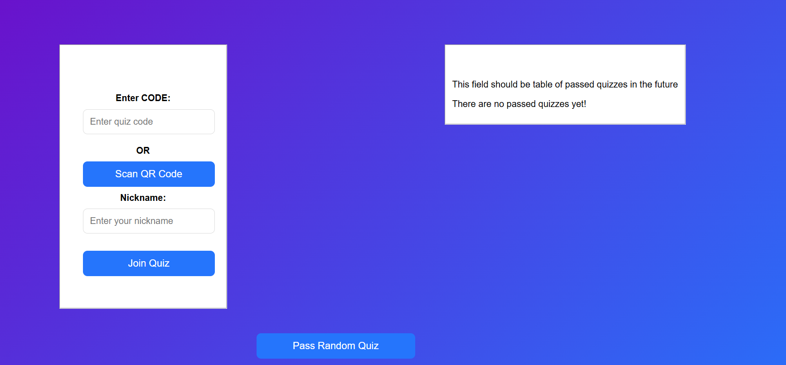

# Kahoot Clone: QuizMaster

## Instructions with the deployed project
- Open https://kahoot-clonee.onrender.com/
- Create an account as a teacher
  - Login into this account
  - In Quizzes page, feel free to create a new quiz, or update existing quizzes or delete a quiz
  - Click on "Start" button, and it will go to the lobby page.
  - The lobby page show the quiz code and a QRCode
- On another browser, create an account as a student 
  - Login into this account
  - Type the quiz code (or scan qr code) provided by the teacher lobby and a username
  - Click on "Join Quiz" button
- Now that at least one student joined, go back to the teacher account and click on "Start"

## Screenshots and decriptions

## Instructions to run in the repository
- Clone the repository https://github.com/AndrewTsebriiSigma/Kahoot_Clone
- Open the terminal and type npm run dev for the react application 
- Go to the server folder (cd server), open a terminal and type node server.js
- Open another terminal inside server folder, and type node socket.js
- Open http://localhost:5173/ in your browser